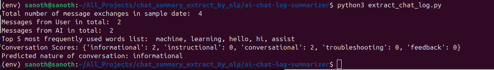

# ai-chat-log-summarizer
Extract chat log summary using NLP

# 🧠 NLP-Based Conversation Analyzer

This project analyzes a simple conversation between a **User** and an **AI** stored in a text file (`sample.txt`). It uses **basic Natural Language Processing (NLP)** techniques to:

- Separate messages by speaker (User/AI)
- Count total messages and individual speaker contributions
- Remove stop words and punctuation
- Find the top 5 most common meaningful words
- Predict the **nature of the conversation** using a rule-based keyword matching strategy

---

## ▶️ How to Run the Script

### 1. Install Required Packages

Make sure you have Python 3 installed. Then, run the script `python3 extract_chat_log.py`:

---

### 📸 Sample Output

---
